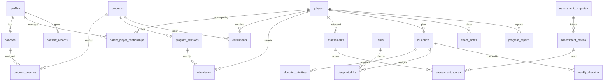

# Database design and access rules

The PBP Player Hub stores its data in Supabase Postgres. Every table is protected by Row Level Security
(RLS), so the database itself decides who can read or change each row. The app's server code will also check
roles, but a bug in page code cannot show one family's data to another.

- Migrations: [`supabase/migrations/`](../supabase/migrations) (applied in filename order)
- Tests: [`supabase/tests/`](../supabase/tests) (pgTAP)
- Seed data for local development: [`supabase/seed.sql`](../supabase/seed.sql) (placeholder assessment
  template only; no people)

## Running the database locally

Nothing here connects to a hosted Supabase project. The local stack runs in Docker.

```bash
npm run db:start   # start local Supabase (applies migrations and seed on first start)
npm run db:test    # run the pgTAP tests
npm run db:reset   # rebuild the local database from migrations + seed
npm run db:stop
```

Without Docker, `npm run db:test:no-docker` runs the same tests on a plain PostgreSQL server (15 or newer,
with pgTAP and `pg_prove` installed). It uses [`scripts/db/supabase-shim.sql`](../scripts/db/supabase-shim.sql)
to stand in for the small part of Supabase the migrations use (the `auth.users` table, `auth.uid()` and the
`anon` / `authenticated` / `service_role` roles). CI always runs the tests against the real Supabase stack.

## Migrations

| File                                  | Contents                                                                                         |
| ------------------------------------- | ------------------------------------------------------------------------------------------------ |
| `..._foundation.sql`                  | Shared enum types, `private` helper schema, `updated_at` trigger, audit trail                    |
| `..._people.sql`                      | Profiles, sign-up trigger, coaches, players, parent–player links, consent                        |
| `..._programs.sql`                    | Programs, coach assignments, sessions, enrollments, attendance                                   |
| `..._assessments.sql`                 | Assessment templates, criteria, assessments, scores                                              |
| `..._development.sql`                 | Drill library, Blueprints, priorities, assigned drills, check-ins, coach notes, progress reports |
| `..._access_helpers_and_workflow.sql` | Access helper functions, role protection, review workflow, audit triggers                        |
| `..._row_level_security.sql`          | RLS on every table and all access policies                                                       |
| `..._foreign_key_indexes.sql`         | An index for every foreign key                                                                   |
| `..._staff_management.sql`            | Account email copy for admins; promotion to coach creates the coach record                       |

## Tables

All 21 charter entities, plus `program_coaches` (which coaches are assigned to which program) and
`profile_emails` (each account's sign-in email, for administrators).



Every table has `created_at`. Every table whose rows can change also has `updated_at`, kept current by a
trigger. Ownership is recorded in `created_by` or an owner column (`parent_id`, `coach_id`, `author_id`,
`submitted_by`, `recorded_by`). `audit_events` and `consent_records` are append-only.

## Who can do what

"Their players" means players linked to the parent in `parent_player_relationships`. "Coached players" means
players with a non-withdrawn enrollment in a program the coach is assigned to (and the coach is active).
Signed-out visitors have no access to any table. Anything not listed is denied.

| Table                                         | Parent                                                               | Coach                                                           | Admin                        |
| --------------------------------------------- | -------------------------------------------------------------------- | --------------------------------------------------------------- | ---------------------------- |
| `profiles`                                    | Read/edit own; read names of co-guardians and their players' coaches | Read/edit own; read guardians of coached players                | All (cannot change own role) |
| `coaches`                                     | Read                                                                 | Read; edit own bio                                              | All                          |
| `players`                                     | Read/edit their players; add players                                 | Read coached players                                            | All                          |
| `parent_player_relationships`                 | Read links for their players                                         | Read links for coached players                                  | All                          |
| `consent_records`                             | Read own; add (for own players)                                      | —                                                               | Read                         |
| `programs`                                    | Read non-draft                                                       | Read non-draft and assigned drafts                              | All                          |
| `program_coaches`                             | Read for visible programs                                            | Read for visible programs                                       | All                          |
| `program_sessions`                            | Read for visible programs                                            | Read; update sessions of assigned programs                      | All                          |
| `enrollments`                                 | Read their players'                                                  | Read for assigned programs                                      | All                          |
| `attendance`                                  | Read their players'                                                  | Read/record/edit for assigned sessions and enrolled players     | All                          |
| `assessment_templates`, `assessment_criteria` | Read                                                                 | Read                                                            | All                          |
| `assessments`                                 | Read **published** for their players                                 | Read coached players'; create; edit drafts; submit own; approve | All; only admins publish     |
| `assessment_scores`                           | Read with a visible assessment                                       | Write while the assessment is a draft (own assessments)         | Write drafts; delete         |
| `drills`                                      | Read active drills                                                   | Read all                                                        | All                          |
| `blueprints`                                  | Read **non-draft** for their players                                 | Read/create/edit for coached players; delete own drafts         | All                          |
| `blueprint_priorities`, `blueprint_drills`    | Read with a visible Blueprint                                        | Write for coached players' Blueprints                           | All                          |
| `weekly_checkins`                             | Read their players'; submit for an **active** Blueprint; edit own    | Read coached players'                                           | Read; delete                 |
| `coach_notes`                                 | Read **parent-visible** notes for their players                      | Read all notes for coached players; write; edit/delete own      | All                          |
| `progress_reports`                            | Read **published** for their players                                 | Same as assessments                                             | All; only admins publish     |
| `audit_events`                                | —                                                                    | —                                                               | Read only                    |
| `profile_emails`                              | Read own                                                             | Read own                                                        | Read all                     |

### Roles

- Every new account is created as a **parent** by a database trigger. The role is never taken from sign-up
  data, because the person signing up controls that data.
- Only an administrator can change a role, and not their own (so PBP cannot lock itself out of admin access).
- A coach also needs an active row in `coaches` and an assignment in `program_coaches` to see any players.
- Promoting an account to coach or admin creates (or reactivates) its `coaches` row automatically.
- Sign-in emails live in `auth.users`, which the app cannot read. A trigger copies each email into
  `profile_emails`, readable only by the account itself and administrators, so coaches never see parents'
  email addresses.

### Assessment and report workflow

```
draft ──submit──▶ submitted ──approve──▶ approved ──publish──▶ published
  ▲                   │                      │
  └──────return───────┴───────return─────────┘
```

| Step                     | Who                                                   |
| ------------------------ | ----------------------------------------------------- |
| Submit                   | The author, or an admin                               |
| Return submitted → draft | The author, or an admin                               |
| Approve                  | A coach assigned to the player's program, or an admin |
| Publish                  | An admin                                              |
| Return approved → draft  | An admin                                              |

- Content can only be edited while a record is a **draft**. Published records are final.
- An assessment cannot be submitted until every active criterion has a 1–5 rating **and** a comment.
- A report cannot be submitted without coach observations.
- The database records who approved and published, and when. These fields cannot be set directly.
- Every step is written to `audit_events`.

### Audit trail

`audit_events` records assessment, report, Blueprint and enrollment changes (created, status changes,
deleted), role changes, consent, and player deletion. Rows are written only by triggers. Details hold what
changed (for example `{"from": "approved", "to": "published"}`), never names or free text. No one can edit or
delete audit rows through the API; administrators can read them.

### Other security measures

- Helper functions used by policies live in a `private` schema that the Data API does not expose. They are
  `SECURITY DEFINER` with a pinned `search_path`.
- Signed-out visitors (`anon`) have no privileges on any table, sequence or function.
- The service role key bypasses RLS. It must only ever be used in server code, never in the browser.

## What the tests check

`01_schema.test.sql` covers rules that must hold for every table, including future ones: RLS on, at least
one policy, no signed-out access, policies apply to signed-in users only, `created_at` present, `updated_at`
maintained, foreign keys indexed, no `SECURITY DEFINER` functions in `public`, audit and consent append-only.

`02_access.test.sql` signs in as fictional parents, coaches and an admin and checks: sign-up always creates a
parent; role changes are admin-only and audited; each family sees only its own players, links, Blueprints and
check-ins; coaches see only their rosters and lose access when a player withdraws; parents see only
parent-visible notes and published assessments/reports; the full submit → approve → publish flow including
who may do each step, locked content after submission, and audit entries.

## Assumptions awaiting a product decision

These follow the most cautious option and are easy to change in a later migration.

1. **Approval authority**: coaches (including the author) approve; only admins publish.
2. **New accounts**: anyone can sign up and becomes a parent. Coaches are promoted by an admin.
3. **Enrollment**: admins manage rosters. Parents cannot enroll players themselves.
4. **Development priorities**: up to three per Blueprint (not exactly three).
5. **Age group**: entered on the player profile, not calculated from graduation year.
6. **Graduation years**: limited to 2027–2038 as in the charter. This will need widening each season.
7. **Deletion**: an admin deletes a player, which removes all of that player's records. Audit rows keep the
   player's id (no name) so the history of approvals survives. A self-service deletion request flow is not
   built yet.
8. **Check-ins**: submitted by a parent for the player's active Blueprint, one per week (weeks start Monday).
   "Question for coach" is stored with the check-in; coach replies are not part of the MVP data model.
9. **Parents see Blueprints** once they leave draft status (active, completed, archived). Blueprints do not
   go through the approval workflow.

## Not done yet

- TypeScript types generated from the schema (`supabase gen types`) will be added in Sprint 1, when the app
  first reads data.
- No hosted Supabase project is connected.
